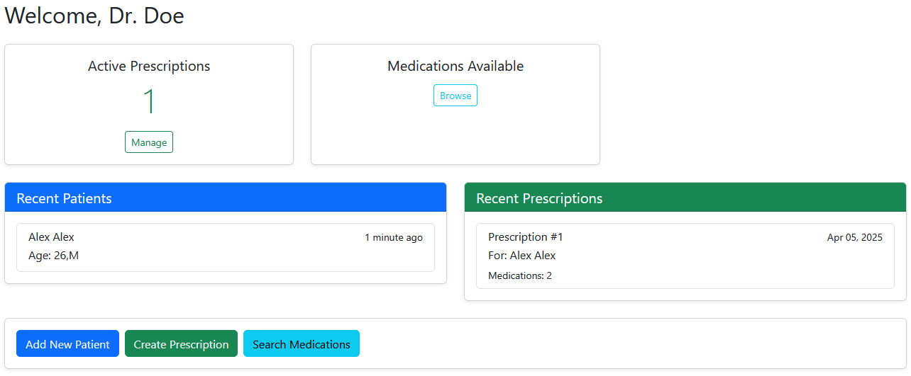
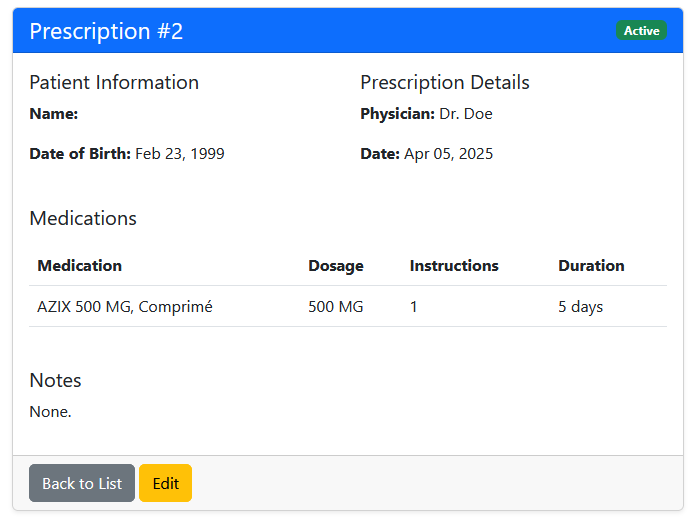
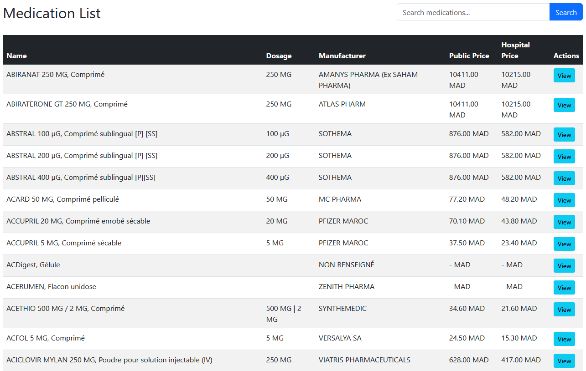

# Prescription Management System

A Django-based web application for physicians to manage patient prescriptions, medications, and medical records.

## Features

- **Physician Authentication**: Secure login, registration, and profile management.
- **Patient Management**: CRUD operations for patient records.
- **Prescription Workflow**:
  - Create prescriptions with multiple medications.
  - Dynamic medication search.
  - Dosage instructions and duration.
- **Medication Database**: Integrated with [medicament.ma](https://medicament.ma) data.
- **Responsive UI**: Bootstrap 5 templates.

## Tech Stack

- **Backend**: Django, Django REST Framework
- **Frontend**: HTML5, Bootstrap 5, jQuery
- **Database**: SQLite

## Installation

1. Clone the repository:

   ```bash
   git clone https://github.com/oebelus/pres-api.git
   cd pres-api
   ```

2. Install dependencies:

   ```bash
   pip install -r requirements.txt 
   ```

3. Import the medication data:

   ```bash
   python manage.py import_medications
   ```

4. Run the development server:

   ```bash
   python manage.py runserver
   ```

## Next Steps

- [x] Import full medication data
- [ ] Implement PDF prescription generation

## Screenshots




